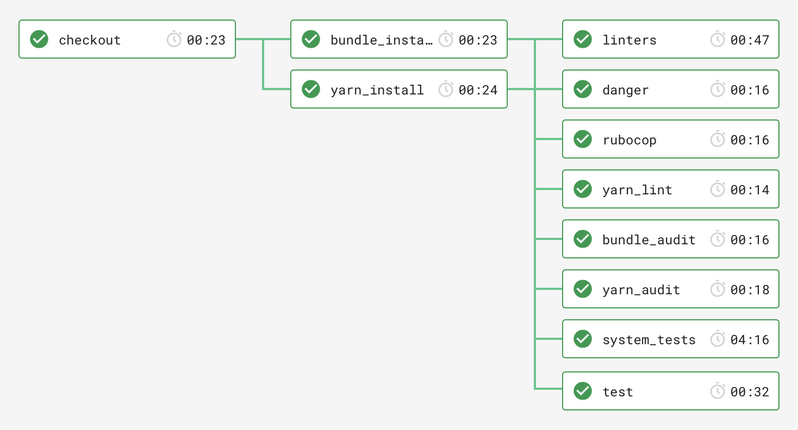

# CircleCI config examples

## [01_config.yml](./01_config.yml)

Configuration for Rails 6 application with Webpacker and:

- Bundler 2.x
- [This Danger configuration](../danger/README.md)
- `bundler-audit` and `rubocop` for Ruby
- `yarn audit` and `yarn lint` for front-end
- ...

